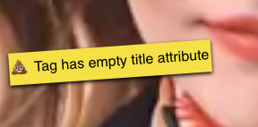
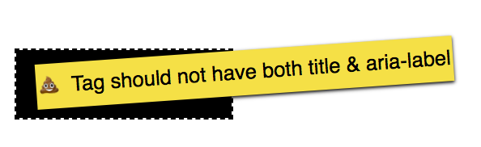
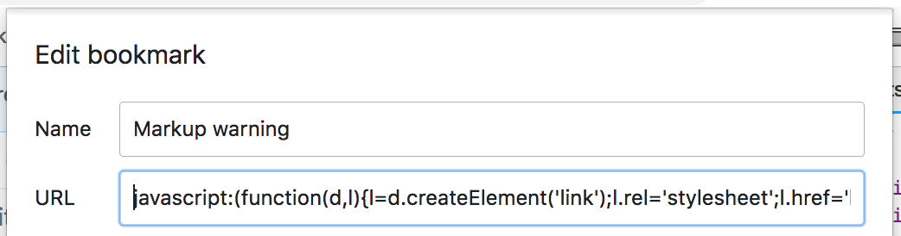

# markup-warnings

Simple helper to highlight inaccessible markup.





Currently this POC only uses CSS Selectors to locate problem markup. To be more comprehensive we'll need the help of Javascript in a future version.

## Usage

### Option 1: Browser bookmark
Add this Bookmarklet to your browser:

* Name: Markup warnings
* URL: `javascript:(function(d,id,el){if(el=d.getElementById(id)){d.head.removeChild(el)}else{el=d.createElement('link');el.rel='stylesheet';el.id=id;el.href='https://unpkg.com/markup-warnings';el.setAttribute('data-project-homepage','https://github.com/georgeadamson/markup-warnings');d.head.appendChild(el)}})(document,'_markup-warnings_')`

Tip: Sometimes Chrome will strip off the "javascript:" prefix when you paste the URL, so make sure it's still there.



### Option 2: Include stylesheet in your page

Add the following stylesheet tag to your page during development. Do not use in production!

```html
<link rel="stylesheet" href="https://unpkg.com/markup-warnings" />
```

## To develop this project

### Requirements

**[Node.js](http://nodejs.org) v4.x.x - v6.9.x .**


```bash
$ git clone https://github.com/georgeadamson/markup-warnings.git
$ cd markup-warnings
$ npm install
$ gulp
```

## What markup problems does this test for?
As many as we can, within the limits of CSS selectors. Look in the scss source files for details. They're largely organised by the type of markup they're targeting, such as aria-label or img alt.