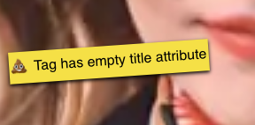
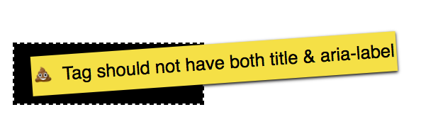
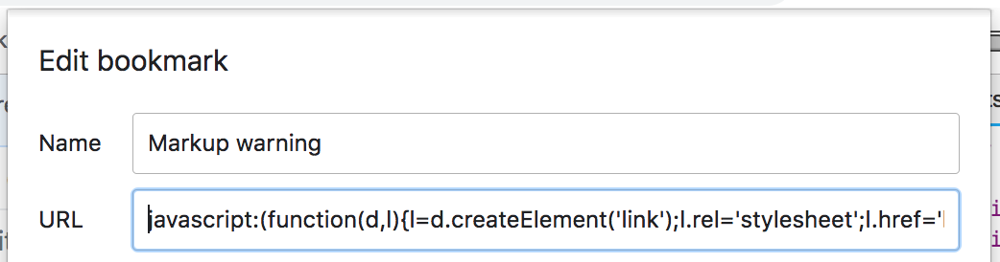

# markup-warnings

markup-warnings is a small development helper for spotting markup that is
likely to cause accessibility or robustness problems.

It works by loading a CSS file into the current page. The stylesheet uses CSS
selectors to find suspicious HTML and ARIA patterns, then adds a visible outline
and message next to the matching element. This makes issues easy to notice while
you are browsing a page, reviewing a UI, or checking a local build.

It is intentionally lightweight and CSS-only. That also means it is a smoke
test, not a complete accessibility audit: it cannot calculate accessible names,
follow DOM references, evaluate JavaScript state, or catch problems that CSS
selectors cannot express.

Warnings include WCAG success criterion numbers when a selector maps cleanly to
WCAG 2.2. Heuristic or browser-support warnings intentionally remain unnumbered.





## What it flags

The rules are grouped by the kind of markup they inspect. Current checks include:

- Empty or placeholder attribute values such as `title="null"`, `alt="undefined"`, `href="false"`, `aria-label="0"`, and similar values often caused by bad data.
- Empty ID, `for`, and ARIA reference/name attributes such as `aria-label=""`, `aria-labelledby=""`, and `aria-controls=""`.
- `title` attributes, including empty `title` attributes and elements that combine `title` with `aria-label` or `aria-labelledby`.
- Missing or suspicious page language attributes, including missing `html[lang]` and language tags that use underscores.
- Links with `href=""`, links with `href="#"`, links without `href`, `javascript:` links, image-only links without accessible text, and empty links without text or an accessible label.
- Images missing `alt`, images with whitespace-only alt text, images that combine non-empty `alt` with `title` or ARIA labels, and alt text that is likely to be unhelpful.
- Image submit buttons and plain button inputs that do not expose a useful label.
- Iframes without a `title`.
- Tables without obvious header cells, empty table headers/captions, and empty or invalid table header attributes.
- ARIA labels on elements or roles where support is limited, ignored, or likely to override useful visible text.
- `aria-describedby` on plain `div` or `span` elements without a role.
- ARIA ID references that look like CSS selectors, `aria-hidden` on focusable content, and redundant native HTML state mixed with ARIA state.
- Redundant or risky `role` attributes on elements with native semantics.
- Abstract, deprecated, or incorrectly cased ARIA roles, plus custom interactive roles that are not keyboard focusable.
- Empty `label` and `button` elements, icon-only buttons without an accessible label, suspicious `tabindex`, and inline `onclick` handlers on non-interactive elements.

Some warnings on replaced elements such as `img`, `input[type="image"]`, and
`iframe` may not render in every browser because pseudo-element support for
those elements is limited.

## Usage

### Option 1: Browser bookmarklet

Create a browser bookmark with this name and URL:

* Name: Markup warnings
* URL:

```text
javascript:(function(d,id,el){if(el=d.getElementById(id)){d.head.removeChild(el)}else{el=d.createElement('link');el.rel='stylesheet';el.id=id;el.href='https://unpkg.com/markup-warnings';el.setAttribute('data-project-homepage','https://github.com/georgeadamson/markup-warnings');d.head.appendChild(el)}})(document,'_markup-warnings_')
```

Clicking the bookmark toggles the stylesheet on the current page. The first click
adds the warnings; the next click removes them.

Tip: Sometimes Chrome will strip off the "javascript:" prefix when you paste the URL, so make sure it's still there.



### Option 2: Include stylesheet in your page

Add the stylesheet tag to a page during development. Do not ship it to
production.

```html
<link rel="stylesheet" href="https://unpkg.com/markup-warnings" />
```

This loads the compiled CSS published by the package through unpkg.

## To develop this project

### Requirements

**[Node.js](http://nodejs.org) v18+.**

```bash
$ git clone https://github.com/georgeadamson/markup-warnings.git
$ cd markup-warnings
$ npm install
$ npm start
```

`npm start` compiles the Sass once, watches `assets/scss/**/*.scss`, and serves the demo page with BrowserSync.

### Build

The production build uses Dart Sass and PostCSS/Autoprefixer to write `assets/dist/css/app.css`.

```bash
$ npm run build
```

### Testing

The tests use Node.js's built-in test runner and do not need a separate test framework. They verify package metadata, Sass modules, build scripts, and compiled CSS selector/message output.

```bash
$ npm test
```
